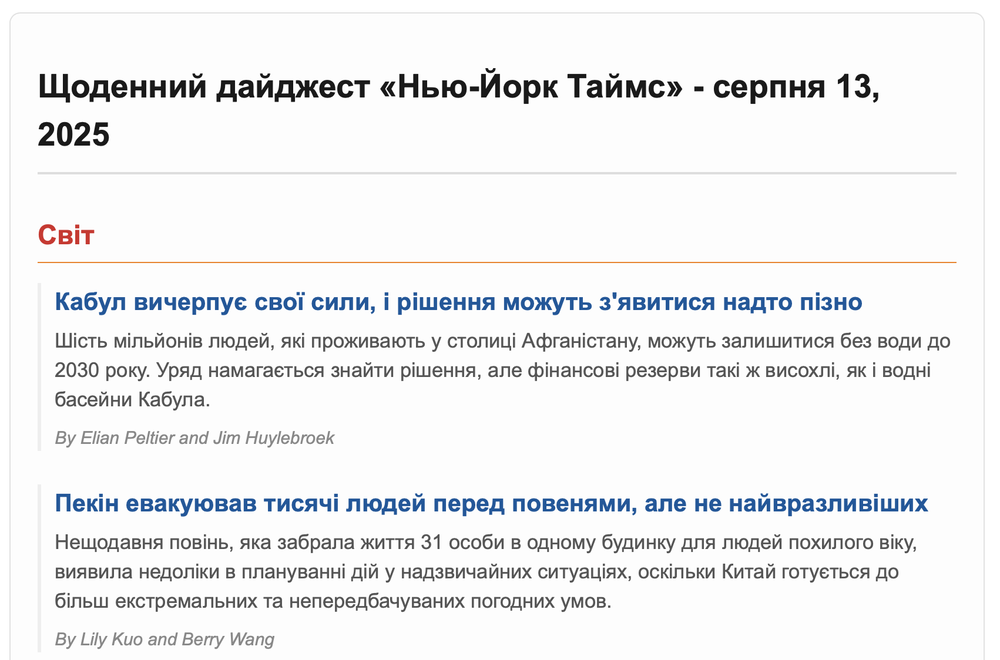

# The New York Times Daily Translated Digest

## Challange
A relative wants to read The New York Times, but isn't fluent with English and doesn't have time for browsing.
She is interested only in World News, Tech, Science, Health, Books and Movies sections.
She is ok with receiving daily emails with Top 5 Stories (excerpts) from each of these sections, if those stories are translated into her native language (Ukrainian).

## Solution

This Python script fetches top stories from multiple, user-defined sections of The New York Times, translates them into a target language using the Google Cloud Translate API, and delivers them as a clean, daily email digest.

This project is using official NYT and Google Cloud Translate APIs, secure credential management, and polite rate-limiting practices.

### Example Email Output



## Features

-   **Multi-Section Digest**: Fetches top stories from a list of sections (e.g., `world`, `science`, `technology`) defined in a simple configuration file.
-   **AI-Powered Translation**: Uses the Google Cloud Translate API to translate headlines and abstracts into any supported language.
-   **Official API Integration**: Connects directly to the NYT Top Stories API for reliable, structured news data, avoiding fragile web scraping.
-   **Robust Error Handling**: Intelligently handles API rate limits (`429` errors) with an exponential backoff retry mechanism.
-   **Secure Credential Management**: Keeps all sensitive API keys, passwords, and service account files separate from the code using `.env` and `.gitignore`.
-   **Configurable & Flexible**: Easily change the news sections, number of stories, target language, and email recipients in `config.json`.
-   **Polite & Efficient**: Uses proactive delays to respect API rate limits and translates all text in a single, efficient batch call.

## How It Works

1.  **Fetch**: The script iterates through the list of sections in `config.json`. For each section, it makes a GET request to the NYT Top Stories API. A 7-second delay is placed between requests to stay well within the API's rate limits.
2.  **Translate**: It gathers the titles and abstracts from all fetched stories and sends them in a single, efficient batch to the Google Cloud Translate API for translation.
3.  **Format**: The translated data is injected into a clean HTML email template, grouping the stories under their respective section headings.
4.  **Deliver**: The final HTML email is sent to all recipients listed in the configuration file via an SMTP server.

## Setup & Installation

### 1. Prerequisites

-   Python 3.7+
-   A **New York Times Developer account** with an API key. The "Top Stories API" and "Books API" should be enabled.
-   A **Google Cloud account** with the "Cloud Translation API" enabled. You will need to create a **Service Account** and download its JSON key file.
-   A **Gmail account** with an **App Password** generated for sending emails (your regular password will not work).

### 2. Clone the Repository & Install Dependencies

It is highly recommended to use a Python virtual environment.

```bash
# Clone the repository (replace with your username and repo name)
git clone https://github.com/iuliiakr/nyt-daily-digest-translation
cd nyt-daily-digest-translation

# Create and activate a virtual environment
python3 -m venv venv
source venv/bin/activate  # On Windows, use: venv\Scripts\activate

# Install required packages
pip install -r requirements.txt
```

### 3. Configure Secrets

This project uses two separate files for secrets, neither of which should ever be committed to Git.

**A. Create the `.env` file:**
Create a file named `.env` in the project root and fill it with your credentials:

```bash
.env
NYT_API_KEY="your_new_york_times_api_key"
GOOGLE_APPLICATION_CREDENTIALS="google_credentials.json"
EMAIL_HOST_USER="your.email@gmail.com"
EMAIL_HOST_PASSWORD="your-16-character-gmail-app-password"
```


**B. Add the Google Credentials JSON file:**
-   Place the JSON key file you downloaded from the Google Cloud Console into the project's root directory.
-   **Rename it to `google_credentials.json`** to match the path in the `.env` file.
-   Ensure you have added `google_credentials.json` to your `.gitignore` file.

### 4. Configure Settings

Open `config.json` to customize your daily digest:
-   `api_sections`: A list of news sections you want in your digest.
-   `max_stories_per_section`: How many stories to fetch from each section.
-   `target_language`: The ISO 639-1 code for the language to translate to (e.g., "uk", "es", "fr").
-   `recipient_emails`: A list of email addresses that will receive the daily digest.

## Usage

You can run the script manually from your activated virtual environment.

#### Standard Run (Sends Email)

```bash
python main_nyt_top5_translated.py
```

#### Dry Run (For Testing)

This will perform all steps *except* sending the email. Instead, it saves the output as `dry_run_digest.html` for you to preview in a browser. This is perfect for testing changes.

```bash
python main_nyt_top5_translated.py --dry-run
```

## Daily Automation (Scheduling)

To make this script run automatically every day, use a scheduler.

#### On macOS or Linux (using `cron`)

1.  Find the absolute paths to your venv's Python executable (`which python`) and your script (`pwd`).
2.  Open your crontab editor: `crontab -e`.
3.  Add a line to run the script at your desired time (e.g., 8:00 AM).

```cron
# Run the NYT Daily Digest every day at 8:00 AM
0 8 * * * /path/to/your/project/venv/bin/python /path/to/your/project/main_digest.py
```

#### On Windows (using Task Scheduler)

1.  Open Task Scheduler and click "Create Basic Task...".
2.  Set the **Trigger** to "Daily" at your desired time.
3.  Set the **Action** to "Start a program".
4.  For "Program/script", browse to the `python.exe` inside your project's `venv\Scripts\` folder.
5.  For "Add arguments", type the name of your script: `main_digest.py`.
6.  For "Start in", put the full path to your project folder.

